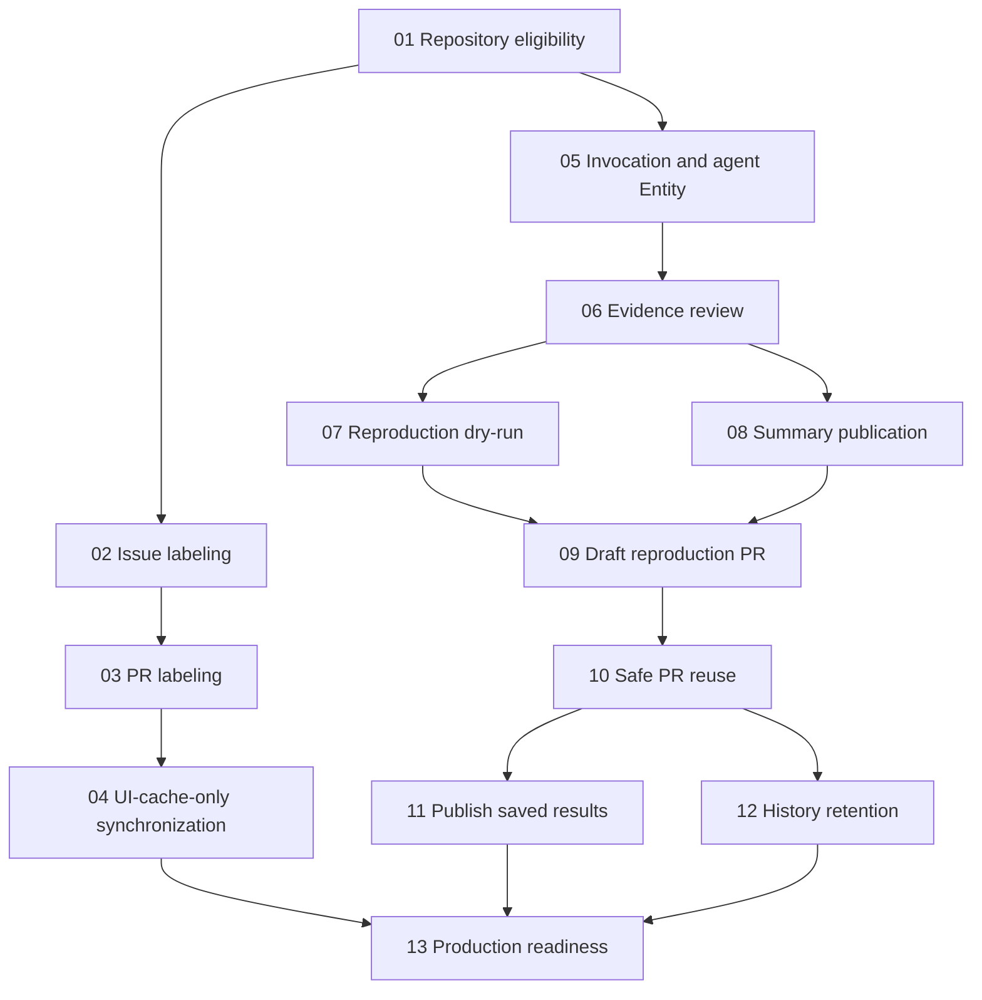

# Issue-review implementation tickets

Status: approved breakdown, published as local tickets. Implementation has not started.

Read the [confirmed specification](spec.md), [backend design](backend-design.md), and [verified implementation facts](implementation-facts.md) before implementing a ticket. Each ticket contains its own acceptance criteria and blocking edges and uses the ready-for-agent status.

Work any ticket whose blockers are complete. Start with ticket 01; afterward, the labeling migration and review development can proceed independently. Ticket 13 gates production readiness on both tracks and retention. No ticket authorizes deployment or live repository opt-in by itself.

| Ticket                                                                                                         | Blocked by |
| -------------------------------------------------------------------------------------------------------------- | ---------- |
| [01: Separate repository eligibility from synchronization](issues/01-repository-eligibility.md)                | None       |
| [02: Evaluate issue labeling directly against GitHub](issues/02-direct-issue-labeling.md)                      | 01         |
| [03: Evaluate PR labeling directly against GitHub](issues/03-direct-pr-labeling.md)                            | 02         |
| [04: Complete the synchronization-as-cache migration](issues/04-ui-cache-only-synchronization.md)              | 03         |
| [05: Admit authorized invocations and expose the review queue](issues/05-review-admission-and-agent-entity.md) | 01         |
| [06: Complete an evidence-based review in dry-run](issues/06-agent-evidence-review-dry-run.md)                 | 05         |
| [07: Produce validated bug reproductions in dry-run](issues/07-validated-reproduction-dry-run.md)              | 06         |
| [08: Publish and maintain the issue summary](issues/08-issue-summary-publication.md)                           | 06         |
| [09: Publish the first draft reproduction PR](issues/09-first-draft-reproduction-pr.md)                        | 07, 08     |
| [10: Handle subsequent reproductions without overwriting human work](issues/10-safe-reproduction-pr-reuse.md)  | 09         |
| [11: Publish saved dry-run results from the frontend](issues/11-publish-dry-run-results.md)                    | 10         |
| [12: Expire detailed history without losing publication ownership](issues/12-review-history-retention.md)      | 10         |
| [13: Verify and enable the complete production workflow](issues/13-production-readiness.md)                    | 04, 11, 12 |

The agent is a persistent cluster Entity per run, not one Workflow per agent. Embedded workflows handle durable actions, including LLM calls and GitHub publication. A separate per-issue scheduler serializes independent runs and publication. Runner restarts can resume persisted state when the sandbox is usable; losing unfinished sandbox work requires a new invocation.
