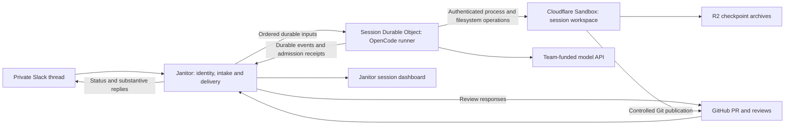

# Multiplayer Janitor MVP implementation specification

Status: accepted implementation handoff

This specification turns the [accepted product scope](../multiplayer-janitor/issues/10-mvp-scope-and-handoff.md) and [technical decisions](map.md) into an implementation handoff. It specifies work to build, not an existing production integration. Decision tickets retain rationale and experimental limits. Later resolutions supersede historical proposals in their comments.

## Outcome and scope

Two authorized teammates collaborate with a Janitor-run agent in one private Slack thread, produce or revise a GitHub PR, and have the agent address authorized GitHub review feedback. Janitor shows current sessions, concise status and recorded token totals. Humans merge PRs.

Support writing, bug fixes and maintenance, starting from an idea, issue or existing PR. Each session uses one connected repository and one home thread. A completed turn leaves the session open for later messages. The first release includes Slack, GitHub feedback and the observation dashboard. Discord, cross-platform mirroring, multi-repository sessions and coordinating separate agents are deferred.

Do not add repeated-mention prompting inside established threads, teammate stop/resume commands, structured question forms, personal model subscriptions, configurable budgets, approval gates, monetary reporting, detailed log viewers or GitHub-to-Slack completion notifications. Cloudflare Artifacts and persistent background processes are deferred.

## Component boundaries

| Component                                  | Owns                                                                                                                        | Boundary                                                                                                                 |
| ------------------------------------------ | --------------------------------------------------------------------------------------------------------------------------- | ------------------------------------------------------------------------------------------------------------------------ |
| Existing Janitor application               | Team/account identity, repository/session associations, platform receipts, input acceptance, delivery outboxes, projections | Existing application SQL and workflow infrastructure                                                                     |
| Separate runner Worker, one DO per session | Native OpenCode conversation, inbox, execution claims, events, usage and alarm supervision                                  | Serialized versioned commands/events; independently built dependencies                                                   |
| Sandbox execution service                  | Isolated session files, process containment, bridge operation journal and checkpoint creation                               | Private binding transport with authenticated, generation-fenced operations                                               |
| R2                                         | Janitor-owned workspace archives                                                                                            | Committed checkpoint references remain authoritative in the runner                                                       |
| GitHub App credential authority            | Installation access and scoped token issuance                                                                               | App private key stays outside repository execution; only scoped short-lived credentials reach controlled Git invocations |

Extend [WorkflowOutbox](../../apps/cluster/src/WorkflowOutbox.ts), its dispatcher/cron, the GitHub journal/ingress pattern, repository readiness and [LiveHub](../../apps/cluster/src/LiveHub.ts). Do not turn workflow retries into a second conversation scheduler. Existing labeling configuration and behavior remain separate.

The existing dispatcher marks an outbox row accepted after submission to the workflow engine, and may claim work concurrently. Add a durable per-session runner-handoff record/workflow that survives that submission receipt until SDK admission is confirmed; enforce order there rather than assuming dispatcher order. Extend GitHub schemas for the required review/comment events. Before existing repository-data deletion runs, persist the generation fence and external cleanup identities so remote resources remain discoverable.

Use OpenCode revision `2df00955cb933e977427535d2505e50cbc689c69` and `@opencode/sdk/workerd/effect`. Build the runner independently with the tested Effect `4.0.0-rc.112` graph; do not downgrade Janitor or let its workspace overrides silently replace runner dependencies. The execution baseline is Sandbox `0.12.9`, base image `cloudflare/sandbox:0.12.9@sha256:4a56a37a3cfd9b38d65bb4b5d0b341e6490a3a4c0226274ae4c1cca4948e85fe`, extended with the production bridge and required GNU tools. Lock the actual resulting image digest and build tools in the release manifest. Fixtures used Wrangler `4.131.1`; they are evidence, not production packaging.

## Identity and repository selection

Cloudflare Access authenticates browser sign-in and account management. Janitor stores a stable teammate ID, verified issuer/subject, admin/member role and active/removed state. Provision the initial admin explicitly. New teammates are members. Enforce last-admin protection transactionally. All active teammates have equal agent control; only admins manage roles and remove/restore teammates.

Prove Slack workspace/user ownership through Slack OIDC after Access sign-in, with bound single-use state and nonce. Enforce one link per teammate/workspace and unique ownership of each workspace/user pair. Prove GitHub numeric user ownership through GitHub App user authorization and authenticated user lookup unless a verified deployed Access mapping actually supplies it. Email and display names are never ownership proof.

Linked accounts remain authorized independently of subsequent Access expiry or Access eligibility. Janitor removal disables all links and browser access while retaining identity ownership and accepted work. Relinking or signing in does not undo removal. Self-disconnection affects future inputs, not shared sessions. Link replacement requires new proof and cannot seize another teammate's identity. Retain authorship as accepted, including stable IDs and display information.

Serialize authorization changes against input acceptance using application database transactions and consistent locking. An input accepted before removal remains accepted; a rejected input cannot become executable on retry after linking/restoration. Recovering a previously unseen event uses current authorization. Preserve previously recorded outcomes.

Start or locate a session from an authorized Slack mention. Resolve a connected repository from an explicit repository, issue or PR reference; ask in the thread if ambiguous. Retain the pending conversation and buffer follow-ups while selection/context initialization is incomplete. No repository tool can run before selection and readiness. A PR maps uniquely to a Janitor session. A second thread targeting it receives the existing home-thread link rather than creating another workspace.

## Durable records and invariants

These are logical records; migrations may combine physical tables without weakening their constraints.

| Owner   | Record and essential fields                                                                                                                                                               |
| ------- | ----------------------------------------------------------------------------------------------------------------------------------------------------------------------------------------- |
| Janitor | Teammate and verified links, role/status, identity revision; unique ownership and administrative audit                                                                                    |
| Janitor | Session ID, repository ID when resolved, generation, home workspace/channel/root, native conversation mapping, PR associations, initialization state                                      |
| Janitor | Platform receipt ID, source, immutable payload reference/hash, receipt time and processing outcome                                                                                        |
| Janitor | Logical input ID, source contribution key, teammate/platform attribution, frozen content, session acceptance sequence, stable runner message ID, authorization outcome and dispatch state |
| Janitor | Projection consumer cursor, cumulative usage snapshot, execution/activity state, freshness and independent delivery health                                                                |
| Janitor | Output ID, source event/turn, destination, ordered payload, publication marker, returned platform ID, retry deadline and reconciliation state                                             |
| Runner  | Native conversation/inbox/events/claims plus `_janitor_*` generation, supervision revision, wake obligation, maintenance/compatibility guard and checkpoint/operation references          |
| Bridge  | Session generation, bridge epoch, immutable operation ID/payload hash, stdin sequence/EOF, output cursors, exit/cancellation state and checkpoint outcome                                 |

Keep source/platform identifiers as exact strings. Decode unsafe numeric GitHub delivery-attempt IDs losslessly before they become JavaScript numbers. Separate the transport GUID from attempt ID and logical feedback identity. Keep timestamps exact when sorting Slack messages.

Uniqueness applies to home-thread mapping, PR routing, logical contribution, runner message ID and logical output intent. Allocation races must adopt the existing identity. Repository reconnect creates new generations/identities; stale work must not revive disconnected sessions.

## Intake and runner handoff

Authenticate platform signatures before journaling eligible deliveries. Slack must receive its prompt acknowledgment after durable receipt, within its delivery deadline; do not await the agent. Receipt is not authorization or completion. Reuse durable journal/outbox transactions and acknowledge duplicate receipts without repeated effects.

Normalize Slack messages by workspace/channel/message timestamp, so overlapping `message` and `app_mention` envelopes produce one contribution. Filter bot/app authors and edit/delete notifications before original-message admission. In a bound thread, ordinary authorized messages are instructions without a mention. Identical text sent twice is two inputs. Edits/deletions do not mutate accepted work.

For a mention inside an existing thread, page discussion through the initiating timestamp, deduplicate repeated root rows and sort precise timestamps. Freeze preceding discussion as attributed context, not executable historical instructions. Buffer later messages during initialization. A channel-root mention establishes its own home thread; do not read unrelated channel history. Missing history blocks initialization with an explanation rather than inventing context.

Atomically accept the authorized input, assign its per-session sequence and persist the runner-delivery intent. Forward one acceptance order across Slack and GitHub; uncertainty about an earlier admission prevents later inputs overtaking it. Retry the same runner message ID and immutable payload after a lost receipt. Accepted retries keep their original authorization outcome.

The versioned runner command boundary requires idempotent session creation, durable input admission, cursor-based event reads, inspection, and operator maintenance/cleanup operations. Creation uses deterministic identities. Admission returns the existing or new durable receipt, never a fabricated turn result. Distinguish incompatible protocol, stale generation, missing session, blocked initialization and retryable transport failure. Do not expose maintenance/cleanup operations as teammate commands.

Before native admission can start execution, persist a wake obligation and arm the alarm. A saved input with a lost response is reconciled by the same ID. Native OpenCode owns promotion, queuing and execution. On restart its oldest queued input may join a resumed turn before the old turn emits its final response; preserve that behavior.

Consume durable runner events with independent exclusive cursors for projection/publication consumers. Apply effects and cursor advancement atomically. Gaps and `log.synced` are valid. Event delivery is at least once. Use durable workflow scheduling for cursor catch-up, with approximately 30-second active-session reads and a five-minute recovery sweep over retained sessions; notifications may accelerate reads but cannot be the sole discovery mechanism. Persist the next catch-up obligation before releasing the current one, including during idle transitions, so a final event cannot become stranded. Transport failures retry reading, not agent execution.

## GitHub feedback and platform recovery

Subscribe to submitted reviews, created inline review comments/replies and PR conversation comments. Route only associated PRs. Authorized reviews/inline replies are automatic inputs; general PR comments require an explicit Janitor mention. Outside feedback stays context until an authorized teammate asks the agent to act. Bot output cannot prompt itself.

Group submitted review body and inline members by the review ID, not event timing. Hydrate paginated membership, map comment IDs once, and handle review/inline envelopes in either order. Verified standalone and later inline comments have their own submitted review IDs; a reply's discussion parent does not determine its review batch. Ignore empty state-only reviews. Keep unclassified/incomplete hydration pending and visible instead of dropping standalone feedback.

Freeze first-successfully-captured content and preserve it on retries. Mutable APIs cannot reconstruct an exact historical submission snapshot. Body-only reviews require their event or recovered delivery; inline hydration cannot infer their absence.

Run five-minute, rate-aware recovery scans. GitHub uses App-authenticated retained-delivery listings with opaque resumable pagination, filtering summaries before payload retrieval and retaining progress after each page. Complete the available retained window rather than stopping at a fixture-specific expected-event count. Slack scans known home threads after their initiating boundary with overlap and logical-input deduplication. Do not replay rejected messages or initial context. Show overdue scans and known gaps. Deleted/unreceived text, never-received start mentions and expired deliveries can be unrecoverable; no lossless catch-up guarantee exists.

## Execution, supervision and workspace durability

Keep one host-scoped native coordinator per session DO. Alarms check approximately every 30 seconds while runnable/recoverable work exists; they are not prompts or execution deadlines. Rearm before fallible inspection. Serialize only short supervisor mutations and recheck the supervision revision before clearing a wake, so an idle observation cannot erase a newer admission's alarm. Preserve existing alarms on construction.

Verify generation, compatibility, maintenance and uncertain-operation guards before SDK host construction, which can start recovery immediately. A healthy execution continues between alarms. An orphaned claim is recovered only after establishing the prior owner is gone and reconciling effects. Recover orphaned claims before ordinary pending-input wake. Never force-start a native terminally failed turn or construct a competing host. Idle questions clear execution checks; later inputs arm them again.

Use a five-minute model-response inactivity deadline, covering first response and stream gaps but excluding time awaiting independent tools. Enforce that timer at the native HTTP request/body boundary while preserving native transport error classification. Keep native retry classification and scheduling: four scheduled provider retries and a fifteen-minute Retry-After cap. Preserve the native ten automatic resumptions per interrupted turn. A further recovery check terminalizes it; ordinary alarms do not consume or reset that allowance. No whole-turn deadline or blanket retry loop is added.

Use the native shell with foreground-only execution, a two-minute default command timeout and explicit longer finite timeouts. Reject zero/unlimited timeouts and background requests. Disable direct session-shell/background entry points and the structured question tool. Ordinary questions finish their turn; any authorized teammate may answer normally, while already queued inputs retain native semantics.

Derive each Sandbox resource deterministically from the logical workspace. Authenticate its bridge over private service/namespace bindings and verify generation/epoch. Support native process cwd, argv, environment, binary stdin, output streams, exit, timeout and cancellation; contain the entire command process tree. Normal shell pipelines are supported; unverified extra descriptor/pipeline-object APIs are outside the adapter contract.

For every mutating operation, persist admission before dispatch. Before returning its native tool result, stop writers, transfer Workerd shell captures into session-owned workspace files, upload a consistent archive, then atomically commit the checkpoint pointer and operation result. Failed commands that leave edits use the same path. Rewrite full-output notices to readable workspace paths and exclude capture files from Git publication.

Archives preserve working tree, index, local commits and required non-reproducible files. Exclude credentials and explicitly rebuildable caches. Verify format/hash and restore into a clean workspace. Retain the prior checkpoint until replacement commit; remove unreferenced uploads and orphans through durable cleanup. Referenced archives remain restorable for the session lifetime. An uploaded but uncommitted archive is not the new source of truth.

Same-epoch retries may retrieve an existing operation. A changed epoch or lost result never authorizes replay of uncertain mutation. Preserve inputs and block dependent work until the operation is positively reconciled. Filesystem checkpoints do not prove whether external publication succeeded.

## Repository publication and outward messages

GitHub App tokens are scoped by installation, numeric repository and permission set, refreshed before expiry and passed only to controlled Git invocations. Keep keys, credential URLs and persistent Git auth configuration out of Sandbox and snapshots. Recheck repository readiness, generation and intended branch before every publication; repository token scope is not branch enforcement.

For existing PR work, update its branch. For new work, use the designated work branch and create a PR when appropriate. Record intended commit/head/base before writes. Incorporate human commits without force-pushing them away; clarify semantic conflicts on the PR. After a lost push/PR response, inspect remote refs and matching PRs before retrying. GitHub PR metadata can lag refs. Unavailable writes preserve changes and explain the limitation; do not create a competing PR without teammate direction.

Slack-origin turns use one updating concise progress message and substantive thread replies. Coalesce pending progress, retain final/error messages, preserve per-session output order and honor per-channel throttling/Retry-After. Split oversized text without corrupting Unicode; the candidate fixture uses 3,900 UTF-8-byte chunks and one-second channel spacing. Production rendering must account for its actual message/block limits. Do not emit a permanent message per token or tool.

GitHub feedback results stay on GitHub: reply inline where possible and in the PR conversation for overall results/clarification. Missing inline targets become explicit delivery problems, not a silent Slack redirect. GitHub completion notifications to Slack remain deferred.

Create output intent durably before sending. Reconcile ambiguous publication by stable marker plus author and destination using paginated reads. Deleted or absent markers do not prove a send failed. Hold uncertain output and dependent work; never blind-repost. Temporary throttling retains pending output. Loss of home-thread access preserves accepted work and pending replies, shows a delivery warning, and resumes delivery when access returns without moving to another channel/DM. Ephemeral onboarding is best effort; Connected accounts remains authoritative.

## Observation and lifecycle

Provide paginated team-wide session list/detail to Access-authenticated active teammates. Channel membership does not restrict these compact reads; it still restricts opening Slack links. Display session/title, repository, home thread, PR links, execution state/reason, meaningful activity, recorded input/output totals, delivery warning and freshness. Detail adds concise activity/error, not raw commands or conversation logs.

Execution states are working, idle, blocked and failed. Maintenance/compatibility holds are blocked with a reason. Completed turns return to idle. Delivery failure and projection staleness are independent. Order working sessions first, then meaningful activity descending with session ID tie-breaker. Heartbeats, usage-only changes and delivery retries do not reorder activity.

Project cumulative usage snapshots by replacement with cursor protection. Display input as input plus cache read/write, output as output plus reasoning. Before any usable snapshot show unavailable. Explain that normalized zeros and missing provider reporting cannot prove billing completeness. No per-person or team totals, pricing or date filters are required.

Commit projection updates and invalidation intent together; reuse HTTP reads plus LiveHub invalidation, reconnect refresh and fallback refresh. Recheck active membership on reads/subscription lifecycle. A missed WebSocket invalidation cannot lose authoritative data.

Repository pause/access loss blocks new repository operations and preserves work. Recovery requires readiness; deliberate pause requires repository resumption. Disconnection fences new work/late completions, terminates execution, deletes native session/workspace/checkpoints/projections, and retains only cleanup tombstones until cleanup completes. Explicitly warn of unpublished-work loss. Published GitHub work remains. Teammate removal alone never deletes shared sessions.

## Models, configuration and upgrades

Use one deployment default for new sessions. Persist an immutable model configuration reference per session; retain older records while needed. Record provider/API model identity, route, endpoint, settings, capabilities, limits, native local compaction policy and secret binding reference. Use the pinned explicit model embedding seam with a real resolver; never ship mocked fixture metadata. Operators manage runner-only secrets, rotating independently of model selection. Invalid credentials or unavailable models produce visible failures; no silent fallback. Permanent retirement requires a new session in the MVP.

Use the [upgrade contract](issues/17-upgrade-compatibility.md#answer) as the release procedure. Its manifest versions protocols, native migration sets, Janitor schemas, checkpoints and bridge capabilities. An outer `_janitor_*` compatibility record and native journal check precede SDK startup. Native migrations are individually transactional and forward-only; partial failure and unknown newer state remain blocked for operator repair.

For incompatible upgrades, persist a maintenance barrier before enumerating sessions, continue authorized durable intake, withhold dispatch, and obtain per-runner quiescence before replacement. Native shutdown preserves recoverable claims; user-stop semantics are not a substitute. Respect finite operation deadlines, committed checkpoints and uncertainty. An unreachable runner is not proof it stopped. Verify actual running bridge compatibility, schema and credentials before releasing the matching hold. Preserve disconnection/removal fences.

Roll back only to a release tested against actual current state and deployed peers. Otherwise repair forward with data preserved. Never reset sessions, rewind publication journals or automatically restore old whole-state snapshots. Keep compatible credentials/model records through rollback. Same-version restart tests do not prove cross-version upgrade safety.

## Configuration and implementation sequence

Provision separate production and test bindings for runner DOs, Sandbox service and R2 checkpoints. Configure Access issuer/audience and initial admin, Slack app/workspace/signing secret/OIDC callbacks, GitHub App installation authority and user-link callbacks, runner service authentication, model records/secrets and version manifests. Configure Slack bot scopes `app_mentions:read`, `chat:write`, `groups:history`, `groups:read` and `metadata.message:read`, with `app_mention`, `message.groups`, `member_left_channel`, `app_uninstalled` and `tokens_revoked` events. These bot grants are separate from user OIDC linking. Subscribe the GitHub App to `pull_request_review`, `pull_request_review_comment` and `issue_comment`; require Contents and Pull requests read/write plus existing labeling permissions, with scoped tokens for the actual operation. Verify installation scopes and repository permissions during setup. Do not use disposable fixture app URLs, tokens, account IDs or test repositories as defaults.

Implement in this dependency order:

1. Add versioned domain schemas and application migrations for identity/links, session associations, receipts, acceptance order, output intents and projections. Add uniqueness and transaction tests, initial-admin setup and verified account linking.
2. Build the isolated runner and production model resolver, deterministic session creation, durable admission/event reads, pre-host compatibility guards and alarm supervision. Use deterministic model tests before the authorized real-provider smoke test.
3. Build the authenticated Sandbox adapter, operation journal/containment, capture/checkpoint ordering, scoped Git credentials and generation-fenced cleanup. Verify real process/filesystem behavior in an isolated environment.
4. Add private Slack intake, initialization/context, authorization, ordered delivery and outward publication. Establish a complete two-teammate Slack workflow before extending feedback sources.
5. Add GitHub review grouping, PR routing/publication/replies, retained-delivery recovery and uncertain-send reconciliation. Run missing-event and mixed-order integration cases.
6. Add dashboard reads/invalidation and cumulative usage projections; test access removal, stale reads and execution/delivery independence.
7. Exercise maintenance, migrations, mixed versions and rollback refusal. Run the complete acceptance workflow, live membership restoration and selected-provider validation before release.

Keep schema readers compatible before enabling new writers. Add components to existing application composition rather than leaving fixtures as production services. The implementation may divide these stages into build tickets without reopening accepted behavior.

## End-to-end acceptance walkthrough

1. Two linked teammates open an existing blog-post PR discussion in a private Slack thread. The first mentions Janitor with the PR link. Janitor selects the repository, binds that PR/session/home thread, and freezes preceding context once.
2. Both Slack subscriptions deliver the mention; only one instruction is admitted. A teammate adds an ordinary reply during execution. Janitor accepts it durably in order; OpenCode queues it without a new mention or companion PR.
3. The agent edits/tests through the Sandbox. A runner restart after tool/checkpoint commit preserves work; a crash before commit retains uncertainty. Safe recovery proceeds without a new message and never replays an unknown publication.
4. The agent updates the same PR branch, preserving intervening human commits. Slack shows concise progress and a substantive result. A lost Slack send response triggers lookup rather than a duplicate post.
5. The second teammate submits a review with inline comments. Events arrive out of order and are redelivered. Janitor admits one grouped review input. A later inline reply becomes a distinct input. The agent updates the PR and replies on GitHub; no completion notification is sent to Slack.
6. Janitor displays working/idle/blocked/failed states and recorded usage without double counting replay. A pending Slack reply remains a delivery warning even if implementation succeeded.
7. Teammate removal racing a message has one durable outcome. Accepted work survives removal; rejected messages stay rejected after restoration. Browser Access expiry alone does not prevent linked-account prompting.
8. During a controlled upgrade, new messages remain durable. Compatibility checks precede recovery, old container images receive no incompatible commands, and release of maintenance preserves order. Unsupported state remains intact and blocked.

## Validation and readiness

Planning evidence is in [repository execution](research/repository-execution-results.md), [runner lifecycle](research/runner-lifecycle-results.md) and [platform verification](research/platform-verification-summary.md). The last includes 22 local checks, actual provider observations and human-confirmed ephemeral visibility. These establish bounded feasibility, not a completed end-to-end implementation.

| Required acceptance area      | Evidence now                                                          | Remaining implementation validation                                                                |
| ----------------------------- | --------------------------------------------------------------------- | -------------------------------------------------------------------------------------------------- |
| Identity and removal races    | Accepted contract                                                     | Real linking callbacks, replay rejection, concurrent ownership/last-admin/removal tests            |
| Runner progress/recovery      | Twenty deployed lifecycle scenarios and local ordinary-question check | Production composition, stable IDs, event catch-up and maintenance integration                     |
| Workspace and Git publication | Deployed deterministic-model/native-tool and scoped GitHub tests      | Production adapter and policy enforcement; protected-branch-specific test when available           |
| Slack/GitHub delivery         | Live receipts/retries/reviews/redelivery, local policy tests          | Distributed admission/outbox integration, live bot removal/reinvite and preserved output           |
| Model behavior                | Simulated native transport                                            | Exact provider streaming/tools/usage, context limits and compaction, bounded authorized smoke test |
| Upgrades                      | Source inspection and same-version restart tests                      | Forward/partial migrations, mixed versions, live maintenance and tested rollback paths             |
| Dashboard                     | Accepted projection contract                                          | Replay, freshness, subscription authorization and cumulative totals                                |

Run appropriate project validation through Vite+. Previous repository checks reported six errors in isolated earlier probes; the latest full suite had one timeout that passed in isolation. Do not present those records as a clean implementation validation. Resolve or deliberately isolate prototype-only checks during build setup, and require the actual implementation's checks to pass.

Temporary Cloudflare verification resources were removed. Slack test-app Event Subscriptions still require human disabling unless already done; their receiver is gone. This cleanup is separate from architecture readiness.

No new live deployment, paid model call or product code is authorized by this specification. The user accepted this handoff and the technical map is resolved. If implementation evidence contradicts an accepted contract, return that concrete conflict for a decision rather than silently weakening it.
