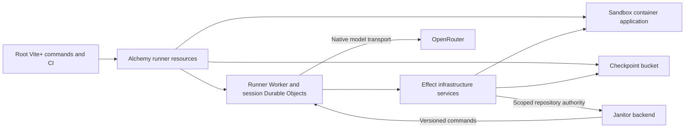

# Integrate the runner into Janitor

## Objective

Make the agent runner a maintained application in this project: installed, developed, checked, built, deployed and operated through the same root workflow as Janitor. Alchemy owns infrastructure lifecycle. Effect services own runtime infrastructure access. Preserve the existing OpenCode execution semantics and live session data throughout the migration.

This plan replaces further broad acceptance walkthroughs as the next engineering priority. Existing validation remains regression coverage; this effort does not claim every release checklist has passed.

## Current state and evidence

- `runner/` is an independent pnpm workspace. OpenCode 2.0.2 uses Effect 4.0.0-rc.112; the root workspace overrides Effect with a commit-pinned snapshot. Root checks exclude the runner.
- `alchemy.run.ts` already provisions the runner Worker, session Durable Object namespace, Sandbox container application, retained R2 checkpoint bucket, bindings and secrets. The local stage skips the runner.
- `runner/scripts/build-deploy.mjs` still obtains registry credentials using raw HTTP and shells out to Docker to build, push and inspect images. It builds a Worker bundle containing the matching release manifest.
- Runtime infrastructure access is spread across native Worker bindings, promises, raw fetch calls and Effect programs. Examples include R2 in `WorkspaceCheckpoints.ts`, Sandbox and repository authority in `RepositoryWorkspace.ts`, and Durable Object lifecycle in `SessionRunner.ts`.
- `.github/workflows/check.yml` runs root checks and tests only. Deployment builds the runner, but runner regression tests are not required PR checks.
- Local image naming and documentation still contain prototype conventions, including `janitor-inspection:ticket05`.

Verified against installed Alchemy 2.0.0-beta.76 source:

- `Cloudflare/Containers/ContainerApplication.ts` exposes external Dockerfile build inputs through `context` and `dockerfile`, and image digest information in resource outputs.
- `Cloudflare/Containers/ContainerProvider.ts` owns image building and registry publishing.
- `Cloudflare/Containers/Container.ts` exposes Effect runtime operations and typed startup failures; a local container provider also exists.
- `Cloudflare/R2/*BucketBinding.ts` provides runtime bucket bindings.

These capabilities are implementation candidates. Compatibility with the pinned Sandbox class, streamed checkpoints and the isolated runner bundle must be demonstrated before replacement.

## Intended architecture

Containers remain isolated Linux workspaces for Git, files and commands. OpenCode's agent loop and durable conversation remain in the Worker/Durable Object runtime. Model inference remains external. Container files are recoverable working state; committed checkpoint pointers and archives retain their current authority.

### Project layout

Target `apps/runner/` for the application, with its runtime source, tests, sandbox source and build configuration together. Declare runner infrastructure in a dedicated module such as `stacks/runner.ts`, composed by `alchemy.run.ts`.

Retain an explicitly excluded nested dependency installation initially if compatibility requires it. Add root task orchestration so developers and CI do not need to know which dependency graph owns a command. Do not equate first-class project ownership with forcing every package onto one Effect version.

A move must update all build paths, CI artifacts, docs, test fixtures and cache inputs together. Moving source files must not rename deployed resources or change session identity.

### Infrastructure ownership

| Concern                                                          | Owner and intended interface                                                                                                                         |
| ---------------------------------------------------------------- | ---------------------------------------------------------------------------------------------------------------------------------------------------- |
| Worker, namespace, container application, R2, bindings, secrets  | Alchemy resource declarations, shared across local and production stages                                                                             |
| Image build, registry authentication and publishing              | Alchemy container/image provider; no application-owned registry REST client                                                                          |
| Sandbox allocation, readiness, process transport and destruction | A runner Effect service using compatible Alchemy runtime capabilities; retain the supported Sandbox SDK adapter where its process contract is needed |
| Checkpoint object reads, streaming writes and deletion           | A checkpoint store Effect service backed by Alchemy's R2 runtime binding where compatible                                                            |
| Repository authority requests                                    | An Effect service over the Alchemy-provided service binding, with typed errors and bounded requests                                                  |
| Native Durable Object lifecycle and SQLite integration           | A thin platform adapter around the OpenCode host; preserve native storage ordering and alarms                                                        |
| Model requests and retries                                       | Existing OpenCode native model route; no parallel model execution engine                                                                             |

Prefer resource-specific capabilities over constructing Cloudflare REST URLs. Alchemy provisioning effects run during deployment, never inside an agent turn. Use typed Effect failures, scoped resources, cancellation, streams, configuration and redacted credentials where applicable. Convert promises only at native SDK/platform interfaces; avoid a new generic cloud abstraction or mechanical rewrites that merely wrap every method.

Do not pass Effect services, Layers, branded runtime objects or SDK instances between different Effect installations. Cross-installation interaction remains serialized commands and platform bindings until compatibility is proven.

## Ordered implementation slices

### 1. Prove compatibility and lock the migration design

Produce a short executable compatibility probe and record its result. Exercise the exact OpenCode Workerd host with the candidate Alchemy runtime integration: session creation, a native tool call, streaming R2 checkpoint upload/restore, container restart and local startup.

Determine whether the pinned releases can safely share one Effect graph. Prefer a supported common graph if the probe passes. Otherwise keep isolated builds and place Alchemy-compatible runtime capabilities in a thin host adapter, with the pinned OpenCode implementation behind its existing interface. A proposal requiring another deployed hop must document its latency and failure costs before adoption.

Explicitly verify that Alchemy's external Dockerfile build path preserves the Sandbox class and container lifecycle expected by `@cloudflare/sandbox`. Keep the current bridge process protocol during this effort.

Exit: a concrete dependency/runtime composition, supported resource APIs, any narrowly required native binding adapters, and a passing probe. Do not import root Alchemy into the isolated runner and assume compatibility.

### 2. Make root tooling and CI own the runner

- Introduce root `vp run runner:install`, `runner:check`, `runner:test`, `runner:test:bridge`, `runner:build` and `runner:dev` entry points, using repository task conventions.
- Make the normal project verification workflow include runner checks. Include both dependency installs in the documented bootstrap path, using frozen lockfiles in CI.
- Add required PR jobs for runner type checking, production bundling, native runner tests and bridge tests. Provision Docker explicitly and retain diagnostic artifacts on failure without credentials or conversation content.
- Keep live paid-provider tests gated separately. CI must not need production secrets for normal checks.
- Move into `apps/runner/` and remove prototype names and obsolete command instructions. Keep lockfiles deterministic and verify which workspace owns every dependency.

Exit: a clean checkout can install and verify the whole project from the root; changing runner code cannot bypass required CI.

### 3. Give Alchemy complete deployment ownership

- Extract the existing declarations into the runner infrastructure module without changing their Alchemy resource addresses. Verify extraction does not add a parent scope that causes replacement.
- Replace manual registry authentication/build/push with Alchemy's Dockerfile-backed container resource path proven in slice 1.
- Retain a build task for OpenCode's required bundler conditions, text imports and production/test entry separation. Use Effect filesystem and command facilities for necessary tooling.
- Preserve immutable release provenance: sandbox source hash, resolved image digest, Worker artifact, protocols, storage versions and pinned SDK migration set.
- Resolve build ordering explicitly: image build and digest first, matching Worker manifest/bundle next, rollout last. Check for dependency cycles in the Alchemy resource graph before removing the current script.
- Use existing Cloudflare credentials and managed GitHub environment configuration. Do not introduce another deployment tool or a second infrastructure state store.
- Retire `build-deploy.mjs` registry logic and overlapping Wrangler deployment configuration after equivalent behavior is proven. Keep test-only configuration where it serves a distinct purpose.

Exit: Alchemy owns the full resource/image lifecycle; a no-change deployment is stable, and source/image mismatch is rejected before rollout.

### 4. Consolidate runtime infrastructure access behind Effect services

Implement checkpoint storage, sandbox lifecycle/process access and repository authority as small, behavior-oriented interfaces with live Layers. Reuse existing implementations where their interfaces already fit.

Use compatible Alchemy runtime resource bindings from slice 1. Keep unavoidable native adapters at the Worker/OpenCode entry points and document why they exist. Remove raw Cloudflare control-plane HTTP calls from application runtime code. Preserve streaming backpressure and cancellation; do not buffer whole checkpoints for convenience.

Preserve these invariants in regression tests:

- Admission and idempotency identities survive restarts and lost responses.
- Epoch/generation fences prevent stale workspace operations.
- Checkpoint intent precedes upload; pointer commit determines the authoritative archive.
- Unknown write/command outcomes require reconciliation, not blind retries.
- Provider credentials remain outside repository tools, persisted conversation and checkpoints; scoped Git credentials remain transient.
- Alarms, maintenance holds, native migrations and cleanup tombstones keep their current semantics.

Exit: infrastructure policy and error handling have clear ownership, and production and tests substitute implementations at the same interfaces.

### 5. Provide a supported local development composition

Replace the local-stage omission with the selected local Alchemy provider composition. One root command starts the backend, runner, local container workspace and checkpoint storage, and reports missing prerequisites clearly.

Use a controlled model and disposable repository by default. Real OpenRouter calls require explicit local configuration. Local development must not use production buckets, namespaces, Slack callbacks or repository credentials.

Verify a tool call, file edit and checkpoint restore locally. Document restart behavior and the minimum command for testing a live-provider request separately.

Exit: developers can reproduce runner and integration failures locally without deploying to the live Slack bot.

### 6. Finish release operations and cut over

- Emit correlated, credential-free timings for receipt, runner creation, container readiness, checkout, first model response, checkpointing and reply delivery. Keep model retry reasons distinct from Slack delivery failures.
- Document instance sizing, concurrency, sleep behavior, container cleanup and checkpoint retention. Verify settings against the pinned SDK and Alchemy APIs; avoid speculative settings.
- Wire existing maintenance hold/drain/release operations into a documented release command for incompatible changes. Identify when an ordinary compatible deployment is sufficient.
- Preserve existing Worker name, namespace/class identities, container identity, R2 bucket and object keys, session identifiers, resource retention policies and secret bindings. Inspect the Alchemy plan for replacements.
- Test on disposable resources first. For production, retain the preceding Worker artifact and image digest and a tested restore path. Storage changes need a compatible migration strategy; code rollback alone is not a storage rollback.
- Deploy through the existing main-branch CI path after review. Confirm a retained session resumes and a fresh session completes, with no duplicate input or publication and no production data deletion.

Exit: the runner has a documented owner, normal development/CI coverage, repeatable releases, useful diagnostics and a demonstrated recovery procedure.

## Scope controls

- No model replacement, provider fallback policy change, agent prompt redesign or Slack narration filtering in this migration.
- No rewrite of OpenCode's conversation engine, SQLite journal or bridge protocol just to increase Effect usage.
- No new shared contract package unless the existing duplicated command schemas demonstrably need one; a serialized seam must stay safe across dependency installations.
- Do not delete old resources or modify live infrastructure as part of writing this plan.

## Completion criteria

The runner is discoverable under the application's project structure; root development and CI include it; Alchemy owns its deployment and image lifecycle; infrastructure access follows the selected Effect/Alchemy composition; supported local development exercises the real runtime; and the migration preserves existing sessions, checkpoints and operational guarantees.

Start with slice 1, then deliver slices 2–6 as reviewable PRs. Each PR carries the relevant regression evidence and updates the release instructions. File relocation, dependency alignment and storage changes should not be combined into one unreviewable cutover.
