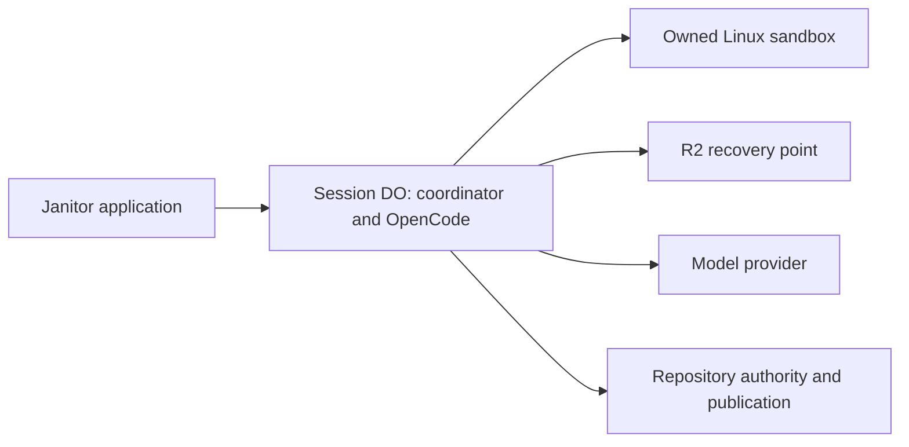

# Integrate the sandbox runner into Janitor

This spec consolidates Q1–Q17 and awaits confirmation of shared understanding before implementation. It supersedes the [earlier integration plan](legacy/pre-sandbox-redesign-spec.md) and SQLite-only workspace direction. The complete accepted requirements are recorded in [interview decisions](sandbox-design-session.md). See [research](sandbox-coordinator-research.md) for evidence and implementation unknowns.

## Architecture

Each agent session has one sandbox-owning Durable Object and isolated Linux checkout. OpenCode runs inside that DO, using its SQLite for conversation and coordinator state. The container runs filesystem operations, Git, dependency installation and repository commands. Threads never share mutable checkouts. Inputs run sequentially in acceptance order.

Alchemy owns the Worker, container-backed DO namespace, image build/publishing, backup bucket, bindings and secrets through the root stack. Retain the separate runner Worker for its bundle boundary as explained in ADR 0001. Eliminate the second coordinator DO.

The DO class composes focused Effect services and extends the supported Sandbox class. Leave SDK lifecycle and alarm ownership intact and use its scheduler. Persist recovery obligations and explicitly reschedule failures; throwing from a scheduled callback does not guarantee retry. Keep application tables distinct from SDK tables.

## Service responsibilities

Use existing project names where they fit these responsibilities.

| Component                        | Owns                                                                             |
| -------------------------------- | -------------------------------------------------------------------------------- |
| Session coordinator              | Admission, attempt identity, interruption, queue gating, deadlines and progress  |
| OpenCode host                    | Conversation, models, tools and usage; gating automatic native recovery          |
| Sandbox workspace                | Prepare/restore, files, commands, cancellation and stopping background processes |
| Recovery store                   | Backup creation, authoritative pointer, restore and obsolete-backup cleanup      |
| Repository authority/publication | Scoped authorization, publication intent and uncertain-write reconciliation      |
| Session delivery                 | Acknowledgement, progress, final reply and authenticated Retry/Skip actions      |

Use supported Sandbox APIs. Do not restore the generic remote child-process/stdio bridge or custom archive server by default. Inspect pinned OpenCode tool/filesystem extension points and adapt or narrowly patch its SDK if necessary. Do not introduce a second model engine.

## Turn and recovery contract

1. Durably accept and deduplicate input before acknowledging it. Queue later inputs.
2. Prepare a checkout or restore the latest confirmed recovery point.
3. Run OpenCode in the DO; tools call the owned sandbox. Persist attempt identity and observation obligations. An open stream is not the durable source of truth.
4. Once model work finishes, stop background processes and prevent workspace writes before saving.
5. Create a recoverable backup, then commit its authoritative pointer and completed-turn record in DO storage. Durably queue the final answer after this boundary. R2 upload and SQLite commit are separate operations.
6. Keep the previous recovery point until replacement is committed, then delete it. Retain the current point for the session lifetime. Preserve unpublished source, untracked work and necessary Git metadata; omit only explicitly disposable caches.
7. Retry failed saving without rerunning the model, within a separate bounded allowance. Persistent save failure is visible, not successful completion. Do not advance dependent inputs while completion is unresolved.

After interruption, retain accepted inputs and conversation history, restore the last completed turn's workspace, and pause the queue. Native recovery must not silently restart the model turn. Retain interrupted activity as history but tell the next attempt which workspace was restored; rolled-back mutations must not be represented as still present.

Retry and Skip apply to a specific input/attempt. Check current participation and deduplicate actions. Retry reconciles unknown external effects before restarting. Skip records the choice and releases queued inputs after outstanding effects are accounted for. Stale buttons cannot affect newer work.

Container recovery cannot undo GitHub writes. Publication intent survives independently of workspace backups. Inspect uncertain branch/PR outcomes before repeating writes, including when a teammate skips an interrupted input.

## Authority and process lifetime

Treat repository scripts as untrusted. Broad GitHub and model credentials remain outside the container. Shell commands may edit, test and commit locally. A dedicated DO-controlled publication tool checks repository authority and pushes changes or creates/updates the appropriate PR. Do not give the general shell GitHub write credentials or add merge authority in this refactor.

Background processes may run during a turn, but stop before saving. Persistent preview servers are out of scope. Keep the sandbox awake during work and saving, then stop it after five minutes of inactivity. Sleeping does not end the session.

Commands default to ten minutes and turns to thirty minutes, both configurable. Command timeout is a tool error the model may handle. Overall timeout interrupts the turn and requires Retry or Skip. Cancellation must stop the underlying operation, not merely stop waiting. Saving has a separate bounded retry allowance; exact retry count/backoff is engineering configuration.

## User interaction

Send one acknowledgement promptly after durable acceptance, before workspace startup. Update it with stages such as preparing workspace, working and saving. Send the final answer separately after durable completion. Keep raw command output and intermediate model commentary out of Slack.

Interruption messages provide Retry and Skip buttons for authorized participants. The dashboard remains an observation view and distinguishes pending input, active work, saving, interruption, save failure and delivery failure. Model execution and Slack delivery recover independently.

## Deployment and cleanup

Initial cutover removes all existing Janitor sessions and their conversation, workspace and backup state. This is authorized for cutover, not during the interview. Fence old inputs, actions and delayed deliveries so they cannot resurrect retired sessions. Published GitHub work, repository connections and unrelated application records are outside cleanup scope.

Future deployments retain sessions and may interrupt active turns. Preserve recovery points and accepted inputs; affected sessions wait for Retry or Skip. Do not build a deployment drain protocol now. Storage changes still require compatible reading/migration; permission to interrupt does not permit retained data loss.

Remove superseded SQLite repository code, abandoned legacy imports, old bridge/image tooling, the second DO and runner-specific drain machinery once replacements are wired. Retain native conversation persistence, repository access checks and durable delivery behavior. Update runtime docs and retire obsolete glossary entries alongside code.

## Validation and development

Target default PR checks at three minutes. Keep typechecking, bundling and focused behavioral tests in the normal Vite+ workflow. Profile the current eight-minute test step before removing or moving coverage; local Alchemy startup did not account for most of that duration.

Full local-stack simulation is optional. No integration check or deployed integration gate is required for now. Do not rebuild the previous extensive cloud simulation suite. TypeScript tests should verify admission ordering, interruption gating, duplicate controls, recovery pointer ordering and external-write reconciliation. Existing transport test seams are already authorized.

## Implementation facts to verify

- Select compatible Sandbox package/image pins and Alchemy resources. Stable and preview APIs differ.
- Gate native OpenCode recovery before automatic model/tool execution; find the smallest supported extension or SDK patch.
- Ensure backup expiry cannot invalidate the latest recovery point during a session's lifetime. Verify metadata preservation and production restore constraints; local extraction differs from production overlays.
- Resolve publication from a Linux checkout without exposing write authority to repository scripts.
- Keep scheduling and inspection from unintentionally waking idle containers. Reconcile uncertain infrastructure operations before retry.

These are engineering checks, not completed validation or additional CI gates. Return to the user if a platform limitation requires changing agreed behavior.
