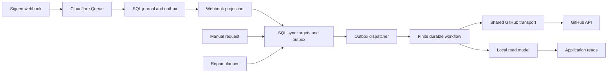

# GitHub synchronization

## Status

Implemented in `apps/cluster`, with the manual control in `apps/web`. This document describes the current implementation rather than the original proposal. See [auto-labeling design](./auto-labeling-design.md) for labeling semantics.

## Goals and scope

Normal application reads use the local database. Scheduled repair, signed webhooks, and manual requests synchronize the GitHub data needed by Janitor. GitHub remains authoritative.

The mirror contains installations, accessible repositories, labels, open issues and pull requests, and closed entities seen through incremental scans or targeted refreshes. Changed files, checks, and reviews are fetched only when a configured or active labeling revision requires them. This is not a complete GitHub history warehouse.

## Execution and ownership

One `sync_target` row represents application installation discovery, an installation inventory, a repository track, or an individual entity. All request paths use `SyncTargets`.

- Invalidations increment `requested_generation` and atomically create an outbox request when no execution owns the scope.
- `execution_generation` identifies the immutable workflow payload. The workflow may cover additional invalidations that arrived before it began.
- Begin captures `active_generation`, `active_sequence`, and `active_full` once. Repeating begin for the same execution returns the same claim.
- The sequence boundary is the greater of the motivating sequence and the current journal high-water mark. This lets authoritative scans repair changes without inventing webhook deliveries.
- Full-scan requests arriving after begin remain pending for the follow-up.
- `withRun` locks and checks the claim in the same SQL transaction as read-model writes. A superseded run cannot publish writes through that fence.
- Completion checks the active generation and atomically records its result and any follow-up outbox request. Verification uses the captured sequence, not the latest requested sequence.

`SyncTargets` owns these transactions. Callers may compose them into larger transactions; they do not need to supply a transaction for correctness. Entity refresh commits entity data, verification, and its labeling handoff together.

The outbox owns due times and idempotent submission. Its lease protects submission attempts. The workflow engine owns execution liveness; these are separate responsibilities.

## Retry and recovery

Rate-limit waits use durable clocks inside the workflow. SQL does not expire a run merely because 30 minutes have passed.

Each minute, the recovery singleton polls accepted pending executions through the workflow engine. A terminal execution that did not complete its target is fenced out and made eligible for a new generation. Live and suspended executions retain ownership. Recovery visits targets in update order with a bounded batch, rotating checked targets to the end.

Failed and blocked target outcomes are eligible for retry after five minutes. The same retry path handles entity targets, repository tracks, inventory, and discovery. New work arriving during a failed run still receives its follow-up. Retry generations preserve a requested full scan.

The outbox singleton recovers unaccepted submissions independently. A missing dispatcher response resubmits the same workflow identity and payload.

## Scheduled synchronization

The planner is woken each minute and plans at most once every five minutes. Installation schedules have a deterministic offset of up to one hour.

| Scope                                                         | Normal cadence         |
| ------------------------------------------------------------- | ---------------------- |
| Discover application installations                            | Four hours             |
| Verify known non-deleted installations and their repositories | Four hours plus offset |
| Repository label catalog                                      | Daily plus offset      |
| Incremental issues and pull requests                          | Four hours plus offset |
| Full open-entity and pull-request repair                      | Weekly plus offset     |

Suspended installations remain eligible for inventory verification so a missed unsuspension webhook can recover. Discovery traverses the application's installation listing, inserts previously unknown installations, and requests their inventories. Existing installation state is verified by its inventory workflow.

`scan_watermark` records incremental progress. `last_full_at` records only a completed full scan. Successful incremental work cannot postpone weekly repair.

Full entity scans use creation order. After a complete scan, locally open entities not observed since its start receive targeted refresh requests. Absence itself never closes or deletes an entity. Incremental scans use update order, `state=all`, and ten minutes of overlap.

The pull-request endpoint has no `since` parameter. Incremental traversal stops after the raw, update-ordered page crosses the overlap boundary; filtering a page does not obscure its continuation decision.

## Pagination and partial progress

Each page fetch has a named durable activity. Entity and pull-request pages are applied idempotently in separate transactions. The workflow does not retain all entity bodies for one final database transaction.

Freshness and incremental watermarks publish only when the full traversal succeeds. A later-page failure leaves earlier observations available but does not certify the track or trigger absence decisions. Full membership is still retained where catalog absence reconciliation requires it.

Pull-request details that lack canonical issue identity request individual entity refreshes. Stale details are distinguished from missing identity and do not request another whole-track scan. Entity refresh establishes canonical identity and details together. Pull-request details carry their own update clock and sequence fence.

Scans are bounded to 200 pages. Exceeding the bound fails the scan without certifying completeness. Changed files are bounded to 300 and explicitly marked incomplete if another page exists. Required checks and reviews follow all pages within the general scan bound; a failure or limit prevents publication of the refreshed snapshot.

Each issue, pull-request, and collection request has its own durable result. A rate limit while reading reviews does not repeat an already successful issue or pull-request fetch.

## Inventory and observation ordering

Webhook projections retain strict sequence ordering. Authoritative installation and repository inventory observations may replace an equal-sequence projection, allowing repair of missed renames and recovered access without a new webhook. Newer projected sequences still reject older scan observations.

Repository absence becomes suspect. Ambiguous `403` and `404` responses block verification rather than deleting identity. A later successful inventory can restore suspect access. Repository enablement continues to control which repositories receive track scans.

## GitHub transport and cache

All synchronization requests use the server-side transport and shared SQL budget. There are two priority classes: foreground requests and background scans. Background work preserves 200 requests for foreground use.

Before acquisition, the budget establishes a lockable row even for simultaneous first requests. It bounds each credential/resource bucket to eight active leases. Expired leases are cleaned up during acquisition.

Requests, including credential acquisition and response-body reading, have a 25-second deadline within the 30-second lease. Cleanup releases the reservation on failure. Successful response processing records the observed budget, any cooldown, and reservation release in one SQL transaction.

Within one reset window, out-of-order observations cannot increase the recorded remaining allowance. Older reset windows cannot overwrite a newer window. Secondary-limit responses are recognized from status or their error message, including when retry headers are absent. Shared secondary cooldowns back off up to fifteen minutes; explicit retry times remain a lower bound.

Conditional cache keys include authorization scope, exact URL, method, API version, and media type. Cached bodies remain encrypted. Stable listings use ETags; changing-`since` entity queries do not create persistent cache entries.

A cached first page never validates a collection. Pagination follows each page's continuation, including probing beyond a formerly full final cached page.

## Manual synchronization and frontend state

`POST /api/v1/sync` requests application discovery, known non-deleted installation inventories, enabled accessible repository tracks, and failed or blocked entity targets. These requests bypass webhook debounce. A manual request can accelerate an unsubmitted debounced execution without changing its payload.

After committing the requests, the route attempts immediate dispatch and returns `202`. Dispatch failure leaves durable work for cron recovery. Human routes remain behind Access verification, with the sync mutation also checking browser origin.

The summary reports pending, failed, and blocked counts. A failed run cannot become a successful idle result merely because it completed. Pending executions do not disappear from the count because they are old. The displayed verification time is the oldest tracked verification and is null if any tracked scope has never verified.

The button keeps POST state separate from summary polling and permits at most one summary request at a time. Polling does not overlap the POST. Completion shows the actual outcome and reloads repository lists, catalogs, and selected repository data without replacing open editor drafts.

## Application integration and maintenance

`SyncIntegration` is the explicit boundary between synchronization and labeling. The production labeling layer supplies required collection tracks, track-verification promotion, and entity snapshot publication. Standalone tests explicitly provide the no-op layer; missing services are not silently interpreted as disabled labeling.

Required collections are the union needed by the active and configured revisions. Failure to load those requirements fails the refresh.

The maintenance singleton handles execution recovery, sync planning, ruleset activation, AI consent settlement, and content purge separately. Failure in one operation does not skip the others.

## Migration and validation

The four [baseline migrations](../apps/cluster/migrations/README.md) create the current schema directly, including immutable run claims, independent full-scan timing, retry timing, pull-request detail ordering, and secondary-limit backoff state. They replace the development migration history and require a fresh database.

When replacing a development database, stop old workers and discard pending development workflow executions before starting the current Worker against the fresh database. Once production launches, preserve the baseline and add forward migrations. Future changes to durable activity boundaries or persisted run semantics need in-flight upgrade tests against the pinned Cloudflare workflow integration; local memory-engine and PostgreSQL tests do not establish deployed upgrade compatibility.

Regression coverage includes concurrent first claims, immutable begin replay, invalidations during a run, old completion and write rejection, completion rollback on follow-up failure, terminal engine recovery, durable waits, independent full repair, incremental pagination stopping, partial-page progress, inventory repair without a webhook, budget acquisition races, out-of-order rate headers, credential failure cleanup, required collection pagination, and failed frontend completion.

Run `vp check` and `vp test run` from the workspace root. The test configuration includes the backend/domain project and the web project's own aliases and DOM setup. Database tests use Testcontainers. For the local rootless Podman runtime, use `DOCKER_HOST=unix:///run/user/1000/podman/podman.sock TESTCONTAINERS_RYUK_DISABLED=true vp test run`.

## Known limits

GitHub pagination is not snapshot-isolated. Overlap, stable-order repair, and targeted verification provide convergence rather than a transactionally consistent remote snapshot. Large installations and repositories beyond the page bound need an explicit increase or a different scan strategy.

Shared leases bound concurrency but do not implement a rolling secondary-limit points model. The transport honors observed primary limits and persisted secondary cooldowns. API token issuance remains the authentication service's responsibility.

A terminal workflow may be retried, so external activities remain at-least-once. The pinned Cloudflare integration still requires live alarm, eviction, and upgrade validation. The whole-system summary describes tracked targets, not a globally atomic GitHub snapshot.
